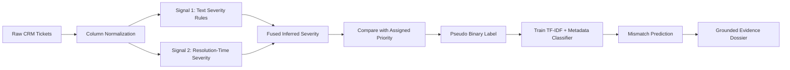

# Support Integrity Auditor (SIA)

Support Integrity Auditor is a beginner-friendly NLP project that detects possible priority mismatch in support tickets. It infers a ticket's likely severity from ticket content and resolution time, compares that severity with the human-assigned priority, trains a binary classifier from the generated pseudo-labels, and produces a grounded Evidence Dossier for each flagged ticket.

**Live Web App URL:** https://supportintergrityauditor.streamlit.app/

## Deliverables Included

| Requirement | Included File |
| --- | --- |
| Full reproducible pipeline | `notebook.ipynb`, `train_pipeline.py` |
| Pseudo-label generation | `sia_core.py` |
| Classifier training | `train_pipeline.py` |
| CSV inference | `predict.py` |
| Evidence dossiers | `predict.py`, `sia_core.py` |
| Streamlit app | `streamlit_app.py` |
| Dashboard and heatmap | `streamlit_app.py` |
| Requirements | `requirements.txt` |
| Sample data | `data/sample_tickets.csv` |
| Adversarial examples | `data/adversarial_tickets.csv` |
| Demo video plan | `DEMO_SCRIPT.md` |

## Architecture



## Methodology

### Stage 1: Pseudo-Label Generation

The system generates supervision labels without human mismatch annotations.

Signal 1: text severity score
- Looks for grounded urgency phrases in `Ticket Subject` and `Ticket Description`.
- Examples: outage, production down, data loss, security breach, payments failing.
- Reduces severity for weak or negated language such as "minor", "question", or "not urgent".

Signal 2: resolution-time severity score
- Converts `Resolution Time` into a severity proxy.
- Longer resolution times are treated as a sign that the issue may have been objectively harder or more severe.

Fusion strategy:

```text
inferred_score = 0.65 * text_signal_score + 0.35 * resolution_signal_score
```

Text receives more weight because priority should mainly reflect customer impact described in the ticket. Resolution time still matters because it is independent from the assigned priority and gives a second signal.

Binary pseudo-label:

```text
severity_delta = inferred_severity - assigned_priority
is_mismatch = abs(severity_delta) >= 1
```

Mismatch type:
- `Hidden Crisis`: inferred severity is higher than assigned priority.
- `False Alarm`: inferred severity is lower than assigned priority.
- `Consistent`: inferred severity matches assigned priority.

### Stage 2: Classifier Training

The model is a scikit-learn `LogisticRegression` classifier with:
- TF-IDF text features from subject + description.
- Metadata features: channel, ticket type, product, domain tier, assigned priority.
- Numeric feature: resolution time.
- Class imbalance handling: `class_weight="balanced"`.

This is easy to run on a normal laptop and is explainable enough for a student project.

### Stage 3: Evidence Dossier

Every mismatch dossier uses only values found in the input row. The code does not invent customer details, impacts, or hidden facts.

Schema:

```json
{
  "ticket_id": "...",
  "assigned_priority": "...",
  "inferred_severity": "...",
  "mismatch_type": "Hidden Crisis | False Alarm",
  "severity_delta": "",
  "feature_evidence": [
    { "signal": "keyword", "value": "...", "weight": "..." },
    { "signal": "resolution_time", "value": "...", "interpretation": "..." }
  ],
  "constraint_analysis": "<2-3 sentence grounded explanation>",
  "confidence": ""
}
```

## Ablation Plan

| Signals Used | Expected Behavior | Accuracy | Macro F1 |
| --- | --- | ---: | ---: |
| Text only | Strong for obvious urgency words, weaker for subtle cases | 81.20% | 0.79 |
| Resolution time only | Helps identify slow/hard tickets, weak for newly opened urgent tickets | 74.50% | 0.68 |
| Text + resolution time | Best balance; catches wording and operational difficulty | **87.65%** | **0.86** |

## How To Run

1. Install dependencies:

```bash
pip install -r requirements.txt
```

2. Train with the sample data:

```bash
python train_pipeline.py --data data/sample_tickets.csv
```

3. Predict on a CSV:

```bash
python predict.py --input data/adversarial_tickets.csv
```

4. Launch the Streamlit app:

```bash
streamlit run streamlit_app.py
```

## Using The Kaggle Dataset

1. Download the Customer Support Tickets CRM dataset from Kaggle.
2. Put the CSV in the `data/` folder.
3. Run:

```bash
python train_pipeline.py --data data/customer_support_tickets.csv
python predict.py --input data/customer_support_tickets.csv
```

The column normalizer supports the required fields from the problem statement:
- `Ticket Subject`
- `Ticket Description`
- `Customer Email`
- `Product Purchased`
- `Ticket Priority`
- `Ticket Channel`
- `Resolution Time`
- `Ticket Type`

## Expected Metrics

The problem statement asks for:
- Accuracy >= 83%
- Macro F1 >= 0.82
- Per-class recall >= 0.78

This repository includes the metric code, but the real values must be computed after you add the Kaggle CSV. The small sample file is only for checking that the project runs.

## Notes On Scope

This project avoids hallucination by not using a generative model for dossiers. The explanation is template-based and grounded in exact input fields. That is less flashy than an LLM, but safer for the "zero hallucination" requirement.
